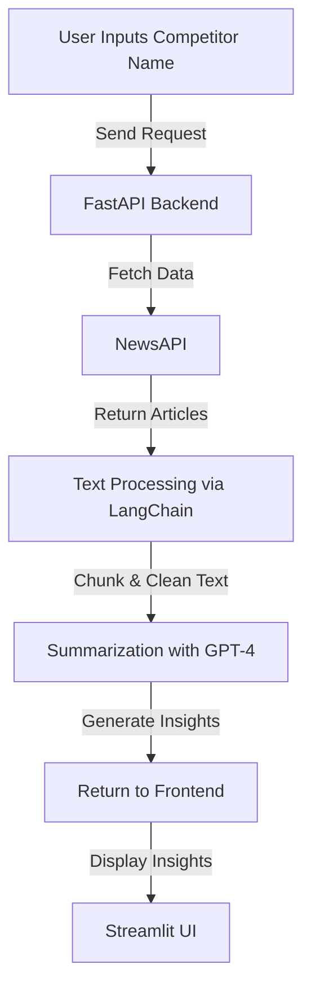

# 🔍 AI-Powered Competitor Analysis Tool with LangChain

## 💡 Project Overview
This project builds an **AI-driven Competitor Analysis Tool** that extracts news articles, processes them with **LangChain**, and generates **insights using GPT-4**. It allows businesses to track **market trends, competitor strategies, and industry insights** effortlessly.


## 💪 Tech Stack
- **FastAPI** - Backend API
- **LangChain** - Text Processing & AI Pipeline
- **OpenAI GPT-4** - Summarization
- **NewsAPI** - Article Retrieval
- **Streamlit** - Frontend UI

---

## 🔄 Multi-Step Pipeline Implementation
Our **LangChain pipeline** follows a structured approach:
1. **Data Extraction** → Fetch competitor-related news using **NewsAPI**
2. **Text Processing** → Split & clean text using **LangChain’s CharacterTextSplitter**
3. **AI Summarization** → Use **GPT-4 via LangChain** to extract key insights
4. **Frontend Integration** → Display insights via **Streamlit UI**

## 🛠️ Setup and Installation

### Step 1: Clone the Repository
```bash
git clone https://github.com/haseebahmed49/langchain-competitor-analysis-pipeline.git
cd langchain-competitor-analysis-pipeline
```

### Step 2: Create a Virtual Environment
```sh
python -m venv venv
source venv/bin/activate
```

### Step 3: Install Dependencies
```bash
pip install -r requirements.txt
```

### Step 4: Set Up API Keys
Create a `.env` file and add your **OpenAI & NewsAPI keys**:
```
OPENAI_API_KEY=your_openai_api_key
NEWS_API_KEY=your_newsapi_key
```

### Step 5: Run the FastAPI Backend
```bash
uvicorn main:app --reload
```

### Step 6: Run the Streamlit Frontend
```bash
streamlit run app.py
```

---

## 🔗 API Endpoints

### **💡 Competitor Analysis Endpoint**
**POST** `/analyze/`

#### **Request Body:**
```json
{
  "competitor": "OpenAI"
}
```

#### **Response:**
```json
{
  "competitor": "OpenAI",
  "summary": "OpenAI is leading AI advancements with new models and integrations..."
}
```

---

## 🎨 Frontend UI (Streamlit)

### 🏆 Features
✅ **Simple UI** for competitor search  
✅ **Real-time AI-generated insights**  
✅ **Error handling for API failures**  

### 👨‍💻 How to Use
1. Enter the competitor’s name in the **input field**.
2. Click **Analyze** to fetch AI-generated insights.
3. View the **summarized key insights**.

---

## 🔄 Workflow Diagram


---

## 💡 Future Enhancements
✅ **Sentiment Analysis** to detect positive/negative trends  
✅ **Multi-source news aggregation** for broader insights  
✅ **Social Media Monitoring** for extended competitor tracking  

---

## 🚀 Contribute & Improve
- Fork this repository
- Submit a pull request with enhancements
- Open issues for discussions

🔗 GitHub Repo: **[(https://github.com/haseebahmed49/langchain-competitor-analysis-pipeline)]**  

#LangChain #OpenAI #FastAPI #Streamlit #Automation

---

## 📞 Contact
👤 **Haseeb Ahmed**  
📍 **Location:** Greater London, UK  
📧 **Email:** haseebahmed02@gmail.com  
🔗 **LinkedIn:** [Haseeb Ahmed49](https://www.linkedin.com/in/haseebahmed49/)  
🔗 **GitHub:** [HaseebAhmed49](https://github.com/HaseebAhmed49)
